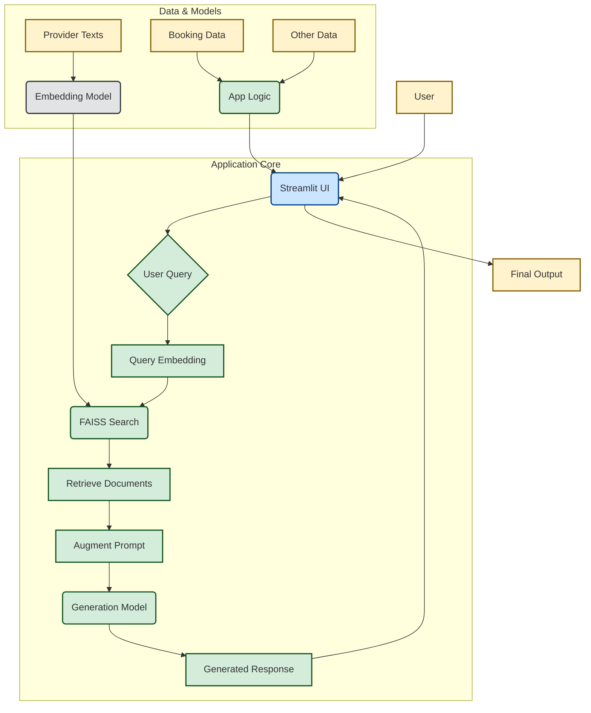

# Bus Ticket Assistant — Offline RAG Streamlit App

This is a minimal **offline RAG** Streamlit app for a Bus Ticket Assistant.
It uses:
- `sentence-transformers/all-MiniLM-L6-v2` for embeddings (free)
- `google/flan-t5-small` for generation (free Hugging Face model)
- `faiss-cpu` for vector search
- `sqlite3` for storing bookings (self-hosted file)

## Project Overview

This project is an offline Retrieval-Augmented Generation (RAG) application designed to assist users with bus ticket inquiries. It allows users to interact with the system through a Streamlit interface to find information about bus services and potentially make bookings.

The application leverages RAG to provide contextually relevant answers by first retrieving relevant information from a knowledge base and then using a language model to generate a coherent response.

### Architecture Diagram

This diagram provides a more professional and detailed view of the application's components and data flow:



**Explanation of Components:**
- **User:** The end-user interacting with the application.
- **Streamlit UI (`app.py`):** The user interface built with Streamlit, handling user input and displaying output.
- **User Query:** The input text provided by the user for bus ticket assistance.
- **Query Embedding:** The user's query is converted into a numerical vector representation using an embedding model (`sentence-transformers`).
- **FAISS Search:** A fast similarity search is performed on a vector index (built from provider texts) using FAISS to find the most relevant documents.
- **Retrieve Documents:** The actual text content of the documents identified by FAISS is fetched.
- **Augment Prompt:** The retrieved document content is combined with the original user query to create a richer prompt for the language model.
- **Generation Model (e.g., `flan-t5-small`):** A language model that takes the augmented prompt and generates a coherent, contextually relevant response.
- **Provider Texts (`data/provider_texts/`):** Raw text data containing information about bus providers, used to build the embedding index.
- **Booking Data (`data/bookings.db`):** A SQLite database storing all booking-related information.
- **Other Data (`data/data.json`):** Additional data files that may be used by the application logic.
- **Embedding Model (`sentence-transformers`):** The model responsible for converting text into numerical embeddings.
- **App Logic:** Orchestrates the entire process, managing data flow, interacting with the database, and coordinating the RAG pipeline.
- **Final Output:** The generated response presented to the user through the Streamlit UI.

## Quick Start Guide for New Users

To get started with the Bus Ticket Assistant, follow these steps:

1.  **Set up a Python Virtual Environment:**
    It's highly recommended to use a virtual environment to manage project dependencies and avoid conflicts with other Python projects.
    *   Create a virtual environment (e.g., using `venv`):
        ```bash
        python -m venv venv
        ```
    *   Activate the environment:
        *   On Windows: `.\venv\Scripts\activate`
        *   On macOS/Linux: `source venv/bin/activate`

2.  **Install Dependencies:**
    Once your virtual environment is active, install all the necessary Python packages listed in `requirements.txt`:
    ```bash
    pip install -r requirements.txt
    ```
    This command will download and install libraries like Streamlit, sentence-transformers, faiss-cpu, etc.

3.  **Prepare Data (Optional):**
    The application comes with sample data. If you have your own custom data, you can place your `data.json` file in the `data/` directory and any custom provider text files in the `data/provider_texts/` directory.

4.  **Run the Streamlit Application:**
    Start the Streamlit server to launch the application:
    ```bash
    streamlit run app.py
    ```
    This command will start the web server, and the application should become accessible in your default web browser.

5.  **Access the Application:**
    The application will typically be available at `http://localhost:8501`. Open this URL in your web browser to use the Bus Ticket Assistant.

## Files
- `app.py` — main Streamlit app
- `data/` — contains sample `data.json` and provider text files
- `data/faiss` — directory where FAISS index and meta will be created after first run
- `data/bookings.db` — SQLite bookings DB (created automatically)
- `requirements.txt` — Python dependencies

## Notes
- First run may download models (sentence-transformers and flan-t5-small) — this requires internet.
- After models are cached, the app runs offline.
- This is a demo scaffold; for production, consider stronger validation, auth, and more robust storage.
